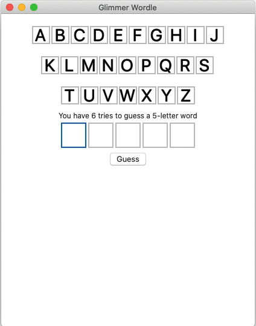

#  Glimmer Wordle 1.1.2
## Play Wordle Endlessly with No Limit!
[](http://badge.fury.io/rb/glimmer_wordle)

[Wordle](https://en.wikipedia.org/wiki/Wordle) word game desktop GUI app written [test-first](https://github.com/AndyObtiva/wordle/blob/master/spec/app/model/five_letter_word_spec.rb) using [Glimmer DSL for SWT](https://github.com/AndyObtiva/glimmer-dsl-swt) (JRuby Desktop Development GUI Framework) as inspiration by [Kevin Newton's blog post](https://kddnewton.com/2022/01/29/solving-wordle-in-ruby.html).


## Demo



## Setup

### Download

[ Download Glimmer Wordle 1.1.2 DMG for Mac ARM64 Monterey and Older](https://www.dropbox.com/s/rmanrz81qfrpqq5/Glimmer%20Wordle-arm64-1.1.2.dmg?dl=1)

[ Download Glimmer Wordle 1.1.2 DMG for Mac x86_64 Catalina and Older](https://www.dropbox.com/s/ysureb9o1dky7w0/Glimmer%20Wordle-1.1.2.dmg?dl=1)

### Install Ruby Gem

If you are a software engineer and would rather install this game as a Ruby gem, please follow these instructions.

First, make sure you have all the [prerequisites of Glimmer DSL for SWT](https://github.com/AndyObtiva/glimmer-dsl-swt#pre-requisites) setup on your machine like Java and JRuby.

Run:

```
gem install glimmer_wordle
```

Afterwards, run:

```
glimmer_wordle
```

## Contributing

-   Check out the latest master to make sure the feature hasn't been
    implemented or the bug hasn't been fixed yet.
-   Check out the issue tracker to make sure someone already hasn't
    requested it and/or contributed it.
-   Fork the project.
-   Start a feature/bugfix branch.
-   Commit and push until you are happy with your contribution.
-   Make sure to add tests for it. This is important so I don't break it
    in a future version unintentionally.
-   Please try not to mess with the Rakefile, version, or history. If
    you want to have your own version, or is otherwise necessary, that
    is fine, but please isolate to its own commit so I can cherry-pick
    around it.

## TODO

[TODO.md](TODO.md)

## Change Log

[CHANGELOG.md](CHANGELOG.md)

## Copyright

[MIT](LICENSE.txt)

Copyright (c) 2022 Andy Maleh. See
[LICENSE.txt](LICENSE.txt) for further details.

--

[](https://github.com/AndyObtiva/glimmer) Built with [Glimmer DSL for SWT](https://github.com/AndyObtiva/glimmer-dsl-swt) (JRuby Desktop Development GUI Framework)

Glimmer Wordle icon made by <a href="https://www.flaticon.com/authors/freepik" title="Freepik">Freepik</a> from <a href="https://www.flaticon.com/" title="Flaticon">www.flaticon.com</a>
